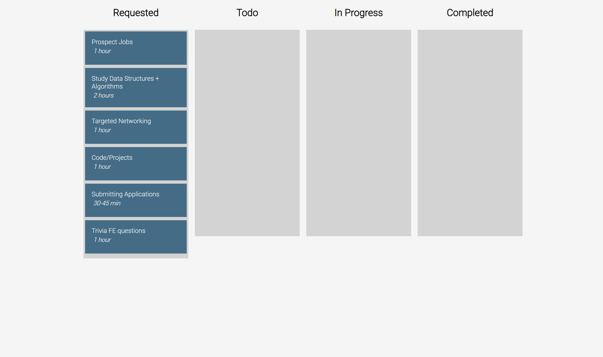

A kanban board application utilizing React drag-and-drop. 

## Technologies
* JavaScript
* React
* Nodejs
* React Drag-and-Drop 
* AWS-Amplify

## Features
* Add tasks to board column
* Remove tasks from board column
* Move tasks along different stages on board using drag and drop

## Possible Future plans
* Allow accessibility through keyboard
* Creating additional boards  
* Implement system to register Users + add user capibilities.
